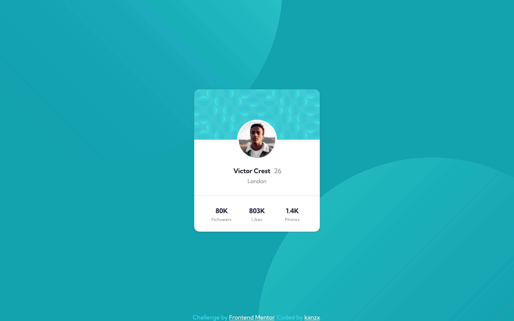

# Frontend Mentor - Profile Card Component Solution

This is a solution to the [Profile Card Component Challenge on Frontend Mentor](https://www.frontendmentor.io/challenges/profile-card-component-cfArpWshJ). Frontend Mentor challenges help you improve your coding skills by building realistic projects.S

## Table of contents

- [Overview](#overview)
  - [The challenge](#the-challenge)
  - [Screenshot](#screenshot)
  - [Links](#links)
- [My process](#my-process)
  - [Built with](#built-with)
  - [What I learned](#what-i-learned)
- [Author](#author)

## Overview

### The challenge

- Build out the project to the designs provided

### Screenshot

#### Screensize 1440px - Desktop

#### Screensize 375px - Mobile

### Links

- View my Solution on [Frontend Mentor](https://your-solution-url.com)
- View the Live Site [here](https://your-live-site-url.com)

## My process

- HTML semantics
- Importing Google Fonts
- Set variables
- Reset default settings
- Styles (Mobile First)

### Built with

- Semantic HTML5 markup
- SASS custom properties
- CSS Grid
- CSS Flexbox
- Mobile-first workflow
- [Google Fonts](https://fonts.google.com/) - For Fonts

### What I learned

There were some questions I had to ask myself while working on this solution. The answers gave me the opportunity to learn the following:

I was wondering what the best place is for an image?

- When the image has a meaning in relation with your content, you should place the image in HTML (provided with alternative text information). If the image is purely decoration, you should place it in CSS with the background-image property.

Why should you always include dimensions for every image?

- A specified width and height of an image let's the browser calculate and reserve required space for the image when the web page loads. As a result it speeds up the display of your web page in the browser.

Why is it good practice to set an image as a block-element ?

- It is practical & efficient to set an image as a block-element, because this will allow you to have maximum control over the styling in context with the surrounding elements. To give an example "margin: 0 auto;" does not work on inline images.

## Author

- Frontend Mentor - [@kxnzx](https://www.frontendmentor.io/profile/kxnzx)
